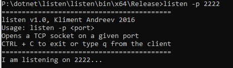
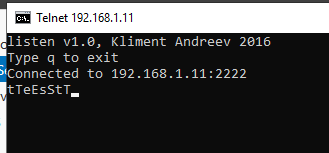

# listen

listen is a small .NET console utility that emulates a generic TCP server/listener.
Primarily it is used to troubleshoot network connectivity.

```
listen v1.0, Kliment Andreev 2016
Usage: listen -p <port>
Opens a TCP socket on a given port
CTRL + C to exit or type q from the client
```

## Example: listen -p 2222




This command will start a TCP listener on port 2222. From another computer, you can telnet to this port and if there are no firewalls or network connectivity issues in between, you'll get a response.
For example, from another computer a connection was made and when typed test, an uppercase response was received from the listen utility.



Type CTRL-C on the utility or **q** on the client side to quit.

**NOTE:** If you get an exception *(SocketException: System.Net.Sockets.SocketException: Only one usage of each socket address (protocol/network address/port) is normally permitted)* it means that the port is already in use.
